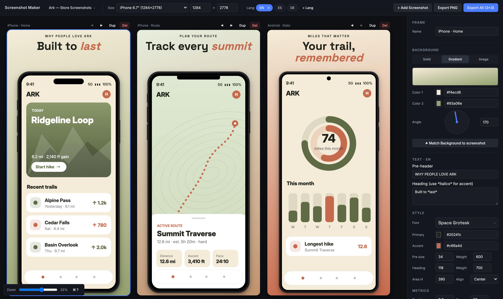
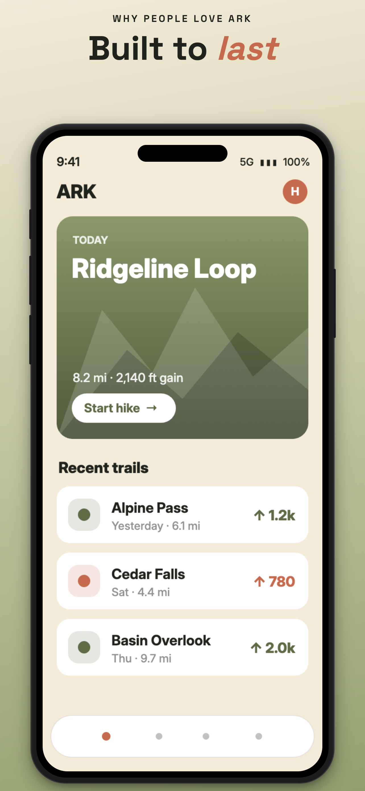
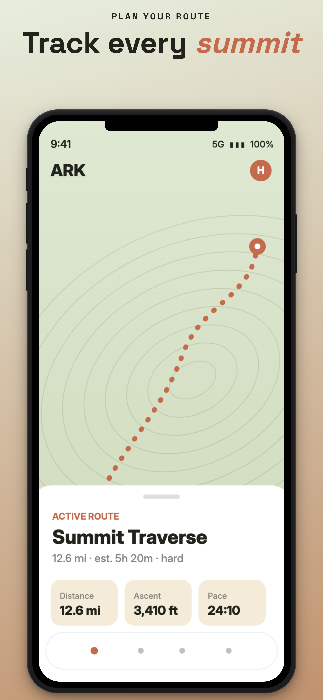
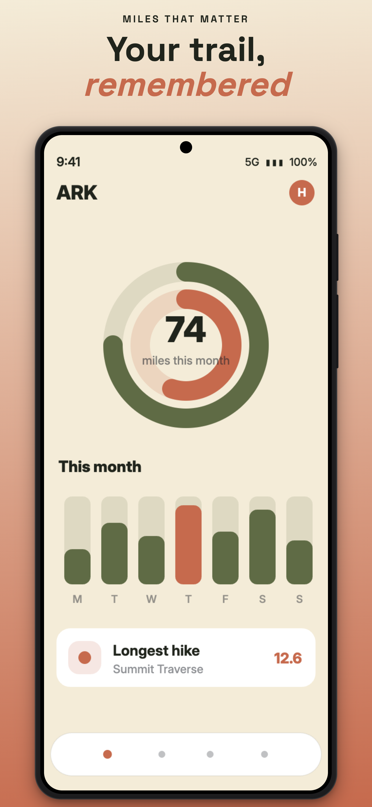
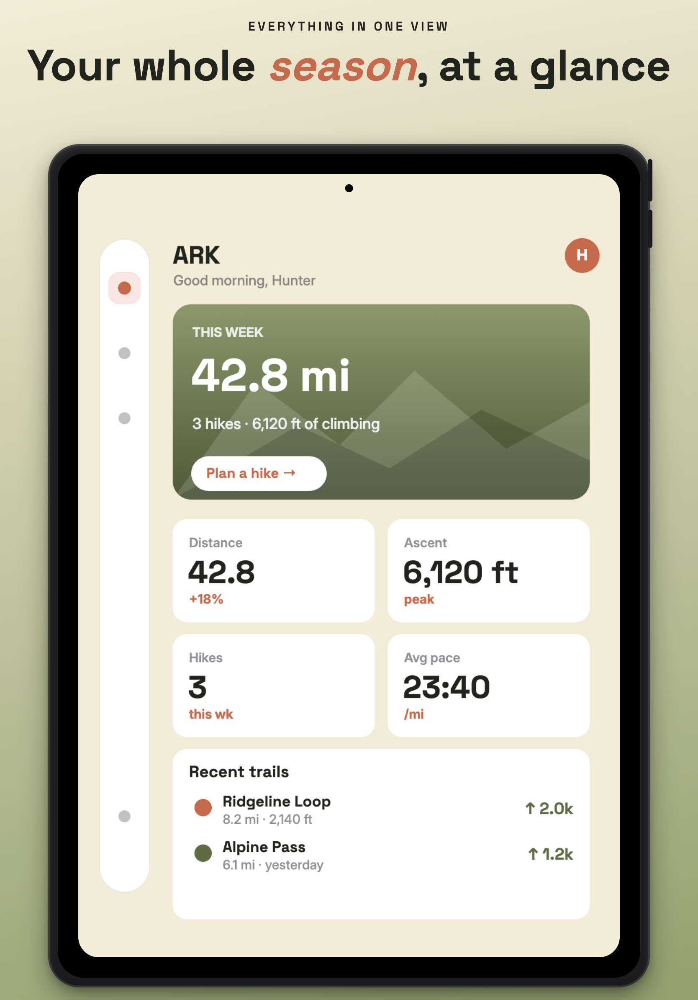
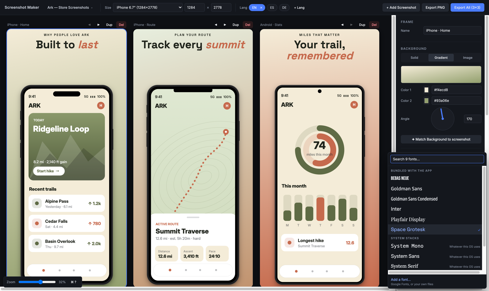

# Screenshot Maker

*A little tool I built so I'd stop hand-exporting App Store screenshots one at a time.*

**[▶ Try the live demo](https://hparamore.github.io/screenshot-maker/)** — the full editor, runs
entirely in your browser, nothing to install. (Saving projects to disk and installing new fonts
need the local dev server; in the demo those quietly fall back to file download/upload.)



I kept hitting the same chore. Every time one of my apps was ready to ship, the store listings
needed the same handful of screens — exported for iPhone, then the bigger iPhone, then iPad, then
Android — and then the whole set again for every language. Change one headline and you're
re-exporting the entire grid by hand in a design tool, praying you got each size right. It was
slow, it was easy to mess up, and it was the least interesting part of shipping.

So I made this for my own projects. You drop in a phone screenshot, write the headline once, and
it renders the whole matrix — every frame × every language, at native store resolution — and
hands you a zip. It's a personal tool more than a polished product, but it's genuinely useful and
I figured it was worth putting out there.

## What it makes

Real exports from the tool, straight to PNG at full store resolution — no design app involved:

<p align="center">
  
  
  
</p>

Same three frames, three device styles — iPhone Pro, an older notch iPhone, and a Pixel-style
Android — and, off screen here, English, Spanish and German, all from one project.

The same project resized for iPad, with the tablet mockup and its own layout:

<p align="center">
  
</p>

## How to use it

1. **Drop a screenshot in.** Drag a PNG onto a frame, or click to browse. It drops straight into
   the device mockup. You can also paste from the clipboard (⌘V) — handy for pulling a screen
   straight out of Figma.
2. **Write your headline.** Each frame has a small pre-header and a big heading. Wrap a word in
   `*asterisks*` to make it italic and accent-coloured — that's the `*last*` and `*summit*` above.
3. **Pick the look.** Choose a device (iPhone Pro, iPhone notch, Android, iPad), set a background, or hit
   **✦ Match Background to screenshot** to pull a two-colour gradient out of the image you dropped
   so the frame feels like part of the app.
4. **Add your languages.** Click **+ Lang**, type a code like `es` or `de`. The language pills in
   the toolbar switch which words show — the design stays put, only the text swaps.
5. **Add and arrange frames.** **+ Add Screenshot** clones the current frame's style with empty
   text; the ◀ ▶ buttons reorder; click a frame's name to rename it (that becomes its export
   filename).
6. **Fix a translation that doesn't fit.** If a German headline runs long and looks wrong, unlock
   that one language and nudge its position or scale — every other language keeps mirroring the
   original. (More on this below.)
7. **Export.** **Export PNG** saves the selected frame. **Export All** gives you a zip of every
   frame × every language, named `FrameName_EN.png`, all at the chosen store size.
8. **Save your work.** The project menu (top-left) saves a `.smproj.json` file you can reopen
   later. It also autosaves to the browser, so a reload never costs you anything.

## Quick start

**macOS** — double-click **`Launch Screenshot Maker.command`**. It checks for Node, installs
dependencies on the first run, starts the server, and opens your browser. (The first time, macOS
may block it — right-click the file → **Open** → **Open** once to get past Gatekeeper.)

**Linux** — `./launch.sh` does the same thing.

**Anywhere, including Windows:**

```bash
npm install
npm run dev      # http://localhost:5173
```

`npm run build` produces a static `dist/` if you'd rather host it; saving projects to disk is the
only thing that needs the dev server running.

## The bits I'm actually proud of

**Write once, translate many.** Text content is per language; the typography, colour, sizing and
layout are shared. Switching a language pill swaps the words and leaves the design alone. And when
a translation genuinely needs different treatment — that German headline that wraps to three lines
— you *unlock* just that language and adjust its position, scale or rotation while everything else
keeps mirroring the master. The words themselves are never forked, so a translation can't quietly
drift from what it was translating.

**Procedural device mockups.** The iPhone, Android and iPad frames are drawn in CSS from a spec,
not pasted in as images — three concentric corner radii, bezels sized as a fraction of device
width. So a mockup is pin-sharp at 1080×1920 and at 2048×2732 alike, and there's nothing to
re-render when you change export size. Adding a device is one entry in `DEVICE_SPECS`.

**Pop-out zoom callouts.** Drag a rectangle over the phone screen and the tool lifts that region
out as a magnified, positionable overlay to point at a detail. The crop stays editable afterwards.

**Batch export.** One click emits every frame × every language as a zip, all at the configured
store resolution.

Also in there: clipboard paste for extra overlays, style templates you can apply to one frame or
all of them, per-frame padding and image pan/zoom, and keyboard shortcuts (press `?` for the list).

## Fonts: download once, local forever



Four families ship with the app. The rest of Google Fonts is one click away — but it gets
**installed**, not linked. Open the picker, search the catalog, choose weights and script coverage,
see what it'll cost in bytes, and install. The files land locally and the family is yours from then
on, offline included.

That "installed, not linked" bit is the whole point. A Google Fonts `<link>` puts a cross-origin
stylesheet in the page, and the export engine can't read those — it silently recovers by refetching
every font on every capture (one Playfair Display export once ballooned to a 6.2 MB file), and it
fails entirely with no network. Local files just work.

**Only the scripts you ship.** Adding all of a family's subsets bloats every export, so the
installer preselects Latin plus whatever your project's languages imply — add a Russian variant and
it checks Cyrillic for you.

**Your own fonts, two ways.** Licensed or corporate families that'll never be on Google can be
dropped in from the picker (validated by file header, not extension) — or, if you'd rather skip the
UI entirely, just put font files in **`public/fonts/custom/`** (one subfolder per family is the
reliable way), relaunch, and they show up under *"Your fonts (dropped in)."* See
[`public/fonts/custom/README.md`](public/fonts/custom/README.md) for that path.

<br clear="right">

## How it renders

The core decision: **frames are real DOM at real export resolution, scaled down only for display.**
A 1284×2778 frame is a `1284px × 2778px` element; the workspace just wraps it in a
`transform: scale(...)` so it fits on screen. Nothing draws to a `<canvas>`.

That buys a lot. Text stays real text — selectable, restyled instantly, typeset by the browser.
Mockups are CSS, so they resample perfectly at any size. And export is just `html-to-image`
capturing the node with the display scale set back to 1 — so what you see is exactly what comes
out, with no separate render path to keep in sync. The cost is that everything lives in two
coordinate spaces (canvas pixels vs. screen pixels), so that math is centralised in
`src/utils/layout.js` and never re-derived inline.

## Project files

Projects save to `projects/` as one self-contained `.smproj.json` — dropped screenshots and all,
embedded as data URLs — so your work lives in your filesystem, not a browser database. They're
git-ignored by default, since they're yours rather than the app's. Writing them goes through a
small file API that only exists while the dev server runs; open the built app on a static host and
the same menu quietly falls back to browser download and upload, producing identical files.

## A note on the dev server

`npm run dev` binds `127.0.0.1` only. The file and font APIs it hosts can read and write inside the
project folder and have no authentication, so they're deliberately unreachable from the network —
and they enforce that per request (non-loopback callers, unexpected `Host` headers, and cross-origin
writes are all refused), not just by trusting the bind address. The font installer adds more on top,
since it fetches on command: callers pass a family *name*, never a URL, and the server builds every
request against a fixed allowlist of Google hosts.

Want to preview on a phone? Opt in with `npm run dev:lan` (or `SM_HOST=<address> npm run dev`). LAN
clients get the app but still not the APIs — the font browser explains itself instead of breaking,
and the project menu switches to download/upload.

## Tech

Vite · React 18 · Zustand (`persist` → `localStorage`) · `html-to-image` · `jszip`. No CSS
framework, no component library, no TypeScript, no backend.

## What's not done yet

- **Per-frame export sizes and mirrored child rows** — a parent row plus smaller child rows that
  inherit its content with per-row tweaks. This is the big one, and the thing that'd make the
  iPad-and-small-phone case fully automatic. The model is already shaped for it: `variantKey()` in
  `src/utils/variants.js` exists so an override key can become `lang@sizeProfile` without the rest
  of the app changing. Per-frame *device type* works today; per-frame *canvas size* doesn't, yet.

## How this was built

I built this with Claude Code as a pair. I drove it as the designer and product owner — the
architecture, the interaction and visual decisions, the taste calls, what shipped and what got
cut — and Claude did a lot of the implementation under that direction, which is how a solo side
project got this much surface area.

I'm leaving the working record in the repo on purpose, because it's an honest picture of how it
actually got made: [WORK_STATUS.md](WORK_STATUS.md) is the session-by-session log with the
reasoning behind each decision, and [CLAUDE.md](CLAUDE.md) is the set of conventions and
invariants I hold the project — and the assistant — to.

## Licence

MIT — see [LICENSE](LICENSE).

Bundled fonts keep their own licences: Inter, Space Grotesk, Bebas Neue and Playfair Display are
SIL Open Font License 1.1, with `OFL.txt` alongside each family in `public/fonts/`. Goldman Sans is
Goldman Sachs' corporate typeface under their own terms, so it is **not** distributed here — the
picker still offers it and it renders if you have it installed, otherwise the stack falls back to
Inter. Anything you install through the font browser or drop into `public/fonts/custom/` is
git-ignored, for the reasons spelled out in `.gitignore`.
